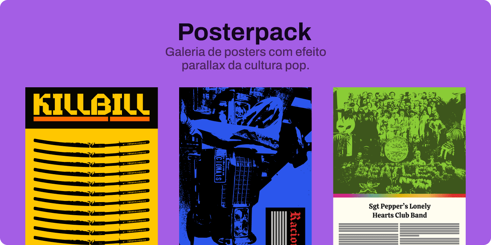

O Posterpack é uma galeria de posters da cultura pop com efeito parallax. A proposta dessa coleção é explorar diversas tendências do design.

Tenho planos futuros de vender o pack em formato digital com alta resolução. Apesar do projeto ser de código aberto, recomendo o uso dos posters é apenas para uso pessoal!

Esse projeto foi feito usando o [Atropos](https://atroposjs.com/) Para fazer os efeitos em parallax.
